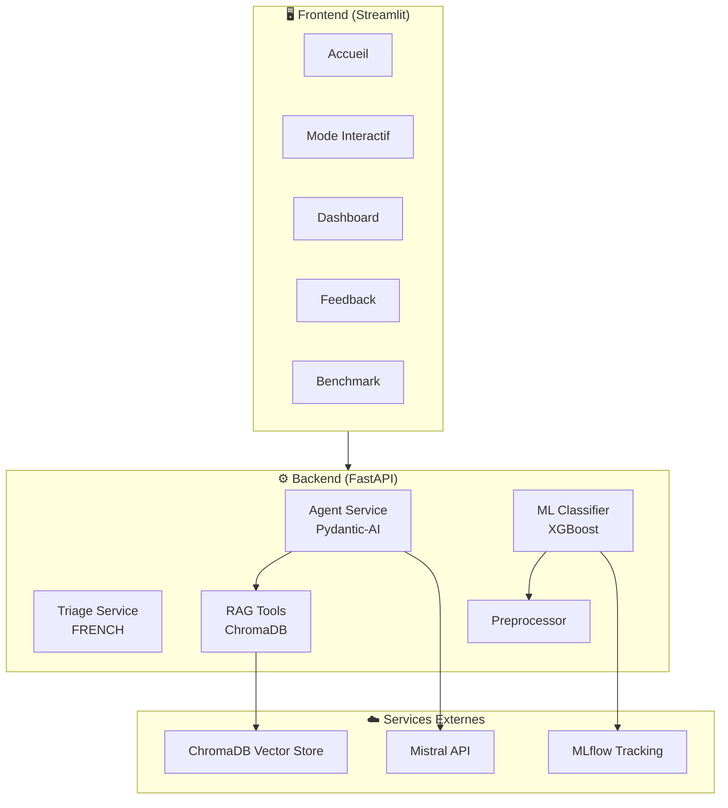

# MedTriage-AI

**Copilote IA pour le triage médical aux urgences**

> **[Application en ligne](https://riadshrn-medtriage-frontend.hf.space/)** - Testez l'application sur Hugging Face Spaces

MedTriage-AI est une application d'aide à la décision pour les infirmiers de régulation médicale. Elle combine un agent LLM, un système RAG basé sur les protocoles médicaux, et un modèle de machine learning pour assister le triage des patients selon la grille FRENCH (FRench Emergency Nurses Classification in-Hospital).

---

## Fonctionnalités

### Accueil - Régulation Agentique
- Sélection et analyse de conversations patient-infirmier
- Extraction automatique des données structurées (constantes vitales, symptômes, antécédents)
- Classification de criticité (ROUGE, JAUNE, VERT, GRIS) basée sur la grille FRENCH
- Affichage des alertes protocole et informations manquantes
- Traçabilité complète du raisonnement de l'agent (logs RAG + outils)

### Mode Interactif - Simulation
- Simulation de conversations avec un patient virtuel (LLM)
- Jeu de rôle patient/infirmier : le LLM simule les réponses du patient
- Accumulation des métriques par session de triage
- Possibilité de tester différents scénarios médicaux

### Dashboard - Pilotage GreenOps / FinOps
- Métriques environnementales en temps réel (CO2, énergie)
- Suivi des coûts par requête LLM
- Statistiques globales persistantes (historique des triages)
- Répartition par niveau de triage et par source
- Analogies parlantes (équivalent recherches Google, minutes d'ampoule 60W)

### Feedback - Amélioration Continue
- Correction des triages par les experts médicaux
- Alimentation du dataset d'entraînement
- Boucle de rétroaction pour améliorer le modèle ML

### Benchmark - Éco-Performance
- Comparaison des modèles Mistral (Ministral 3B, Small, Medium, Large)
- Tests sur 3 cas d'usage : Extraction, Agent Triage, Simulation
- Labels énergétiques (A-E) pour guider le choix du modèle
- Visualisation comparative (énergie, CO2, coût, latence)

---

## Architecture



---

## Choix Techniques

### LLM & Agent
| Composant | Choix | Justification |
|-----------|-------|---------------|
| **Provider LLM** | Mistral AI | Entreprise française, bon rapport qualité/prix |
| **Framework Agent** | Pydantic-AI | Réponses structurées garanties, outils intégrés |
| **Modèle par défaut** | `mistral-small-latest` | Rapide et économique |

### RAG (Retrieval-Augmented Generation)
| Composant | Choix | Justification |
|-----------|-------|---------------|
| **Vector Store** | ChromaDB | Simple à déployer, stockage persistant |
| **Embeddings** | `paraphrase-multilingual-MiniLM-L12-v2` | Supporte le français |
| **Sources** | Protocoles SFMU | Référence officielle du triage en France |

### Machine Learning
| Composant | Choix | Justification |
|-----------|-------|---------------|
| **Classifieur** | XGBoost | Performant et interprétable |
| **Features** | Constantes vitales + données patient | Données cliniques standards |
| **MLOps** | MLflow | Suivi des modèles et versions |

### GreenOps / Observabilité
| Composant | Choix | Justification |
|-----------|-------|---------------|
| **Métriques CO2** | Formule calibrée | Estimation basée sur tokens + latence |
| **Référence** | EcoLogits | Standard pour mesurer l'impact des LLM |
| **Dashboard** | Temps réel + historique | Suivi par requête et sur la durée |

### Infrastructure
| Composant | Choix | Justification |
|-----------|-------|---------------|
| **Backend** | FastAPI | Rapide, documentation auto |
| **Frontend** | Streamlit | Prototypage rapide en Python |
| **Containerisation** | Docker Compose | Tout-en-un (MLflow + Backend + Frontend) |
| **Build** | uv | Builds plus rapides que pip |

---

## Grille de Triage FRENCH

L'application implémente la grille officielle FRENCH (SFMU - Mars 2018) :

| Niveau | Couleur | Délai | Description |
|--------|---------|-------|-------------|
| Tri 1 | ROUGE | Sans délai | Détresse vitale majeure |
| Tri 2 | ROUGE | < 20 min | Atteinte patente |
| Tri 3A | JAUNE | < 60 min | Atteinte potentielle avec comorbidités |
| Tri 3B | JAUNE | < 90 min | Atteinte potentielle sans comorbidités |
| Tri 4 | VERT | < 120 min | Atteinte fonctionnelle stable |
| Tri 5 | GRIS | < 240 min | Pas d'atteinte évidente |

---

## Structure du Projet

```
medtriage-ai/
├── backend/
│   ├── api/
│   │   ├── routes/          # Endpoints FastAPI
│   │   ├── services/        # Logique métier (agent, triage, ML)
│   │   ├── schemas/         # Modèles Pydantic
│   │   ├── ml/              # Classifieur XGBoost, preprocessing
│   │   └── data/            # Générateur de données, labeling
│   ├── models/              # Modèles ML sauvegardés
│   └── data/                # Base vectorielle ChromaDB
│
├── frontend/
│   ├── pages/
│   │   ├── 0_Accueil.py          # Régulation agentique
│   │   ├── 1_Mode_interactif.py  # Simulation patient
│   │   ├── 2_Dashboard.py        # GreenOps / FinOps
│   │   ├── 3_Feedback.py         # Correction expert
│   │   ├── 4_MLFlow.py           # Interface MLflow
│   │   └── 5_Benchmark.py        # Comparaison modèles
│   ├── app.py               # Point d'entrée Streamlit
│   ├── state.py             # Gestion session_state
│   └── style.py             # Composants UI personnalisés
│
├── mlflow/                  # Configuration MLflow
├── docs/                    # Documentation technique
└── docker-compose.yml       # Orchestration des services
```

---

## Installation

### Prérequis
- Docker & Docker Compose
- Clé API Mistral (obtenir sur [console.mistral.ai](https://console.mistral.ai))

### Lancement

```bash
# 1. Cloner le repository
git clone https://github.com/riadshrn/medtriage-ai.git
cd medtriage-ai

# 2. Créer le fichier .env à la racine du projet
echo "MISTRAL_API_KEY=votre_clé_api_ici" > .env
echo "LLM_MODEL=mistral-small-latest" >> .env

# 3. Lancer les services
docker-compose up --build
```

### Accès
- **Frontend** : http://localhost:8501
- **Backend API** : http://localhost:8000/docs
- **MLflow** : http://localhost:5000

---

## Sécurité

L'agent médical intègre une couche de protection contre les injections de prompt :
- **Sandwich Defense** : Les données patient sont encapsulées dans des balises XML
- **Instructions explicites** : Le modèle est instruit d'ignorer toute tentative de modification des instructions système

---

## Équipe

Projet réalisé dans le cadre du Master SISE - Cours LLM.

---

## Licence

This project is licensed under the MIT License - see the [LICENSE](LICENSE) file for details.
