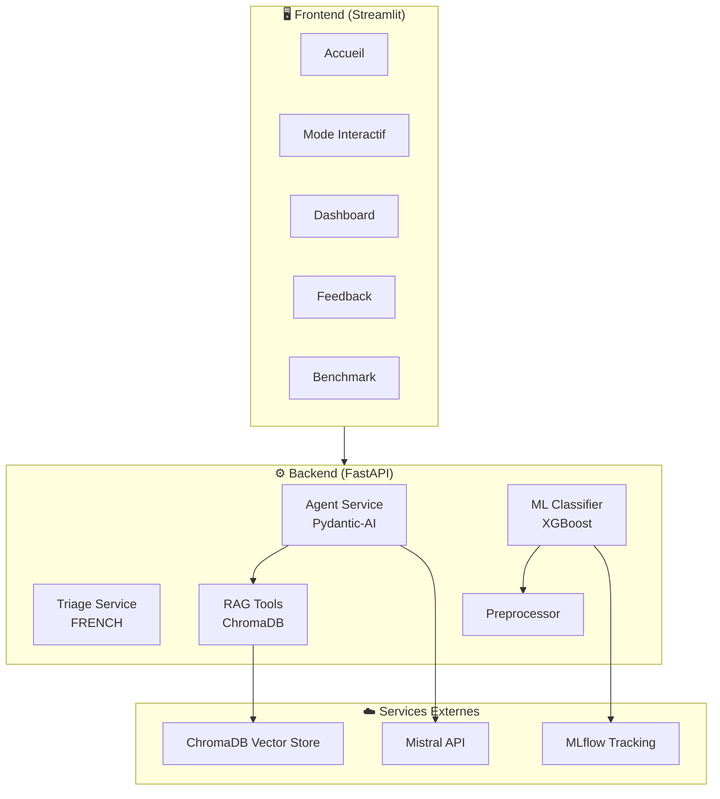

<p align="center">
  
</p>

<p align="center">
  <strong>Copilote IA pour le triage médical aux urgences</strong>
</p>

<p align="center">
  
  
  
</p>

<h3 align="center">🚀 Applications Déployées</h3>

<p align="center">
  <a href="https://riadshrn-medtriage-frontend.hf.space/">
    
  </a>
  <a href="https://riadshrn-medtriage-backend.hf.space/docs">
    
  </a>
  <a href="https://riadshrn-medtriage-mlflow.hf.space/">
    
  </a>
</p>

<p align="center">
  <em>Hébergé sur</em> 
</p>

---

## 🛠️ Technologies Utilisées

### Stack Principal

<p align="center">
  
  
  
  
</p>

### Intelligence Artificielle & Machine Learning

<p align="center">
  
  
  
  
</p>

### RAG & Vector Database

<p align="center">
  
  
</p>

### MLOps & Monitoring

<p align="center">
  
  
</p>

### Déploiement

<p align="center">
  
  
</p>

---

## 📋 À Propos

MedTriage-AI est une application d'aide à la décision pour les infirmiers de régulation médicale. Elle combine :

| Composant | Technologie | Rôle |
|-----------|-------------|------|
| 🤖 **Agent IA** | PydanticAI + Mistral | Analyse et extraction des données cliniques |
| 📚 **RAG** | ChromaDB + MiniLM | Recherche dans les protocoles médicaux |
| 🎯 **ML Classifier** | XGBoost | Classification du niveau de triage |
| 📏 **Règles Expertes** | FRENCH (SFMU) | Standard officiel de triage français |

---

## ✨ Fonctionnalités

### 🏥 Accueil - Régulation Agentique
- Sélection et analyse de conversations patient-infirmier
- Extraction automatique des données structurées (constantes vitales, symptômes, antécédents)
- Classification de criticité (ROUGE, JAUNE, VERT, GRIS) basée sur la grille FRENCH
- Affichage des alertes protocole et informations manquantes
- Traçabilité complète du raisonnement de l'agent (logs RAG + outils)

### 💬 Mode Interactif - Simulation
- Simulation de conversations avec un patient virtuel (LLM)
- Jeu de rôle patient/infirmier : le LLM simule les réponses du patient
- Accumulation des métriques par session de triage
- Possibilité de tester différents scénarios médicaux

### 📊 Dashboard - Pilotage GreenOps / FinOps
- Métriques environnementales en temps réel (CO2, énergie)
- Suivi des coûts par requête LLM
- Statistiques globales persistantes (historique des triages)
- Répartition par niveau de triage et par source
- Analogies parlantes (équivalent recherches Google, minutes d'ampoule 60W)

### 📝 Feedback - Amélioration Continue
- Correction des triages par les experts médicaux
- Alimentation du dataset d'entraînement
- Boucle de rétroaction pour améliorer le modèle ML

### ⚡ Benchmark - Éco-Performance
- Comparaison des modèles Mistral (Ministral 3B, Small, Medium, Large)
- Tests sur 3 cas d'usage : Extraction, Agent Triage, Simulation
- Labels énergétiques (A-E) pour guider le choix du modèle
- Visualisation comparative (énergie, CO2, coût, latence)

---

## 🏗️ Architecture



---

## 🔧 Choix Techniques

### LLM & Agent

| Composant | Choix | Justification |
|-----------|-------|---------------|
|  | Mistral AI | Entreprise française, bon rapport qualité/prix |
|  | Pydantic-AI 0.2.4 | Réponses structurées garanties, outils intégrés |
|  | `mistral-small-latest` | Rapide et économique |

### RAG (Retrieval-Augmented Generation)

| Composant | Choix | Justification |
|-----------|-------|---------------|
|  | ChromaDB | Simple à déployer, stockage persistant |
|  | `paraphrase-multilingual-MiniLM-L12-v2` | Supporte le français (384 dims) |
|  | Protocoles SFMU | Référence officielle du triage en France |

### Machine Learning

| Composant | Choix | Justification |
|-----------|-------|---------------|
|  | XGBoost | Performant et interprétable |
|  | Constantes vitales + données patient | Données cliniques standards |
|  | MLflow | Suivi des modèles et versions |

### GreenOps / Observabilité

| Composant | Choix | Justification |
|-----------|-------|---------------|
|  | EcoLogits | Standard pour mesurer l'impact des LLM |
|  | 55g CO2/kWh | Mix électrique français (bas carbone) |
|  | Temps réel + historique | Suivi par requête et sur la durée |

### Infrastructure

| Composant | Choix | Justification |
|-----------|-------|---------------|
|  | FastAPI | Rapide, documentation auto (OpenAPI) |
|  | Streamlit | Prototypage rapide en Python |
|  | Docker Compose | Tout-en-un (MLflow + Backend + Frontend) |
|  | uv | Builds plus rapides que pip |

---

## 🏥 Grille de Triage FRENCH

L'application implémente la grille officielle FRENCH (SFMU - Mars 2018) :

| Niveau | Couleur | Délai | Description |
|--------|---------|-------|-------------|
| Tri 1 | 🔴 **ROUGE** | Sans délai | Détresse vitale majeure |
| Tri 2 | 🔴 **ROUGE** | < 20 min | Atteinte patente |
| Tri 3A | 🟡 **JAUNE** | < 60 min | Atteinte potentielle avec comorbidités |
| Tri 3B | 🟡 **JAUNE** | < 90 min | Atteinte potentielle sans comorbidités |
| Tri 4 | 🟢 **VERT** | < 120 min | Atteinte fonctionnelle stable |
| Tri 5 | ⚪ **GRIS** | < 240 min | Pas d'atteinte évidente |

---

## 📁 Structure du Projet

```
medtriage-ai/
├── 📂 backend/
│   ├── 📂 api/
│   │   ├── routes/          # Endpoints FastAPI
│   │   ├── services/        # Logique métier (agent, triage, ML)
│   │   ├── schemas/         # Modèles Pydantic
│   │   ├── ml/              # Classifieur XGBoost, preprocessing
│   │   └── data/            # Générateur de données, labeling
│   ├── models/              # Modèles ML sauvegardés
│   └── data/                # Base vectorielle ChromaDB
│
├── 📂 frontend/
│   ├── pages/
│   │   ├── 0_Accueil.py          # Régulation agentique
│   │   ├── 1_Mode_interactif.py  # Simulation patient
│   │   ├── 2_Dashboard.py        # GreenOps / FinOps
│   │   ├── 3_Feedback.py         # Correction expert
│   │   ├── 4_MLFlow.py           # Interface MLflow
│   │   └── 5_Benchmark.py        # Comparaison modèles
│   ├── app.py               # Documentation & point d'entrée
│   ├── state.py             # Gestion session_state
│   └── style.py             # Composants UI personnalisés
│
├── 📂 mlflow/               # Configuration MLflow
├── 📂 docs/                 # Documentation technique
└── docker-compose.yml       # Orchestration des services
```

---

## 🚀 Installation

### Prérequis

<p>
  
  
  
</p>

### Lancement

```bash
# 1. Cloner le repository
git clone https://github.com/riadshrn/medtriage-ai.git
cd medtriage-ai

# 2. Créer le fichier .env à la racine du projet
echo "MISTRAL_API_KEY=votre_clé_api_ici" > .env
echo "LLM_MODEL=mistral-small-latest" >> .env

# 3. Lancer les services
docker-compose up --build
```

### Accès aux Services

#### 🌐 En Production (Hugging Face Spaces)

| Service | URL |
|---------|-----|
| 🖥️ **Frontend** | [riadshrn-medtriage-frontend.hf.space](https://riadshrn-medtriage-frontend.hf.space/) |
| ⚙️ **Backend API** | [riadshrn-medtriage-backend.hf.space/docs](https://riadshrn-medtriage-backend.hf.space/docs) |
| 📊 **MLflow** | [riadshrn-medtriage-mlflow.hf.space](https://riadshrn-medtriage-mlflow.hf.space/) |

#### 💻 En Local (Docker)

| Service | URL |
|---------|-----|
| 🖥️ **Frontend** | http://localhost:8501 |
| ⚙️ **Backend API** | http://localhost:8000/docs |
| 📊 **MLflow** | http://localhost:5000 |

---

## 🔒 Sécurité

L'agent médical intègre une couche de protection contre les injections de prompt :

| Protection | Description |
|------------|-------------|
| 🥪 **Sandwich Defense** | Les données patient sont encapsulées dans des balises XML `<patient_data>` |
| 🚫 **Blocklist** | 40+ patterns d'injection bloqués (DAN, jailbreak, etc.) |
| ✅ **Validation Pydantic** | Tous les inputs sont validés avec des schémas stricts |

---

## 📈 Métriques & Performances

| Métrique | Valeur | Objectif |
|----------|--------|----------|
| 🎯 Accuracy (ML) | 85-92% | > 80% |
| 📊 F1-Score (macro) | 0.83-0.89 | > 0.80 |
| ⚡ Latence moyenne | < 500ms | < 1s |
| 🌱 CO2 / requête | ~0.003g | Minimiser |

---

## 👥 Auteurs

Projet réalisé dans le cadre du **Master SISE** - Université Lyon 2

- **Riad SAHRANE** 
- **Constantin REY-COQUAIS**
- **Eugénie BARLET**
- **Perrine IBOUROI**

---

## 📄 Licence

Ce projet est à but éducatif. Les protocoles médicaux FRENCH sont la propriété de la SFMU.

